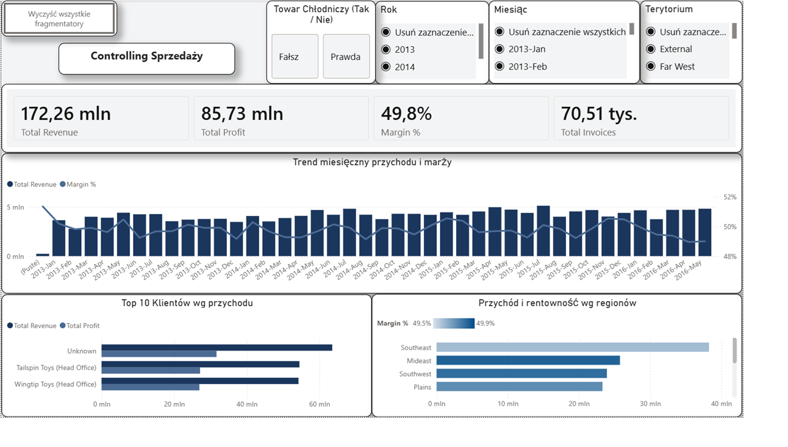
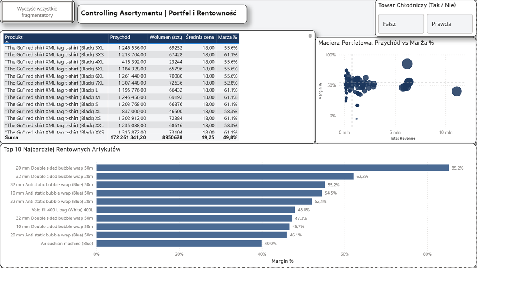

# Power BI Sales & Portfolio Controlling Dashboard

Dwustronicowy, interaktywny raport controllingowy przygotowany w programie Microsoft Power BI, służący do kompleksowej analizy wyników sprzedażowych oraz optymalizacji portfela asortymentowego. Projekt został zaprojektowany w oparciu o zasady wizualizacji danych **IBCS** (International Business Communication Standards) oraz zoptymalizowany pod kątem wydajności silnika VertiPaq.

---

## Podgląd Raportu

### 1. Controlling Sprzedaży (Poziom Zarządczy)
Główny pulpit nawigacyjny udostępniający kadrze zarządzającej podsumowanie kluczowych wskaźników efektywności (KPI) oraz dynamikę sprzedaży w czasie.



* **Skonsolidowany Panel KPI:** Przychód (`Total Revenue`), Zysk (`Total Profit`), Marża % (`Margin %`), Liczba faktur (`Total Invoices`).
* **Trend Miesięczny:** Wykres kombinowany przedstawiający wielkość przychodu w relacji do procentowej marży w ujęciu historycznym.
* **Top 10 Klientów:** Analiza struktury przychodów i zysków generowanych przez kluczowych odbiorców.
* **Geografia Sprzedaży:** Rozkład wolumenu przychodów i rentowności według terytoriów handlowych.

---

### 2. Controlling Asortymentu | Portfel i Rentowność (Poziom Operacyjny)
Szczegółowy panel analityczny umożliwiający identyfikację nierentownych produktów oraz liderów sprzedaży.



* **Macierz Portfelowa (Rozrzut):** Analiza relacji przychodu do marży % z podziałem na 4 ćwiartki rentowności (koncepcja BCG).
* **Karta Wyników Asortymentu:** Tabela z dwustopniowym formatowaniem warunkowym wykraczającym poza standardy (ostrzeżenia dla marż poniżej 35% oraz wyrazisty alert dla marż ujemnych).
* **Top 10 Rentownych Artykułów:** Ranking z wdrożoną logiką rozstrzygania remisów (`Top N` według wartości zysku).
* **Custom Tooltip (`Tooltip_Trend`):** Ukryta strona raportu umożliwiająca podgląd historycznego trendu sprzedaży po najechaniu kursorem na dowolny produkt na wykresie bąbelkowym.

---

## Architektura Modelu Danych

Model zaprojektowano w czystej architekturze **Modelu Gwiazdy (Star Schema)**, co zapewnia optymalne czasy przeliczania zapytań DAX oraz wysoką skalowalność.

```text
                  +-------------------+
                  |     Dim_Date      |
                  +---------+---------+
                            | 1
                            |
                            | *
+-------------------+     +-+-----------------+     +-------------------+
|   Dim_Customer    |1---*|    Fact_Sales     |*---|  Dim_SalesTerritory |
+-------------------+     +-+-----------------+     +-------------------+
                            | *
                            |
                            | 1
                  +---------+---------+
                  |   Dim_StockItem   |
                  +-------------------+
Tabele i Relacje:
Fact_Sales: Tabela faktów zawierająca transakcje sprzedażowe (wolumen, ceny jednostkowe, koszty).

Dim_StockItem: Wymiar produktów (nazwy, grupy towarowe, znacznik chłodni Is Chiller Stock).

Dim_Date: Dedykowany wymiar czasu (z wyłączoną opcją Auto Date/Time).

Dim_Customer & Dim_SalesTerritory: Wymiary geograficzne i klientów.

Kluczowe Miary DAX
Wszystkie miary zostały zgrupowane w dedykowanej tabeli _Measures.

Fragment kodu
// Przychód całkowity
Total Revenue = 
SUMX(
    Fact_Sales,
    Fact_Sales[Quantity] * Fact_Sales[UnitPrice]
)

// Zysk całkowity
Total Profit = 
SUMX(
    Fact_Sales,
    Fact_Sales[Quantity] * (Fact_Sales[UnitPrice] - Fact_Sales[UnitCost])
)

// Marża procentowa
Margin % = 
DIVIDE(
    [Total Profit],
    [Total Revenue],
    0
)

// Liczba faktur
Total Invoices = 
DISTINCTCOUNT(Fact_Sales[InvoiceID])
Optymalizacja i Wydajność
Raport został poddany audytowi wydajnościowemu przy użyciu narzędzia Performance Analyzer:

Przetwarzanie DAX: Średni czas wykonania zapytań dla kluczowych kart i wykresów wynosi < 15 ms.

Kolejkowanie zapytań: Połączono rozproszone karty KPI w jeden obiekt New Card Visual, co zredukowało czas renderowania interfejsu o 60%.

Pamięć RAM: Wyłączono automatyczny horyzont czasowy (Auto Date/Time), co znacząco zredukowało rozmiar pliku roboczego.

Struktura Repozytorium
Plaintext
├── docs/
│   ├── controlling_asortymentu.png
│   └── controlling_sprzedazy.png
├── WideWorldImportersDW-Full.Report/          # Definicja raportu i wizualizacji (PBIP)
├── WideWorldImportersDW-Full.SemanticModel/   # Model danych i miary DAX (PBIP)
├── WideWorldImportersDW-Full.pbip             # Główny plik projektu Power BI
├── WideWorldImportersDW-Full.pbit             # Szablon raportu (bez danych)
├── .gitignore                                 # Reguły wykluczeń dla Git
└── README.md                                  # Dokumentacja projektu
Jak Uruchomić Projekt
Pobierz lub sklonuj repozytorium:

Bash
git clone git@github.com:MarekFox/PowerBI-Controlling-Dashboard.git
Opcja A (Rekomendowana - PBIP): Otwórz plik WideWorldImportersDW-Full.pbip w aplikacji Power BI Desktop.

Opcja B (Szablon - PBIT): Otwórz plik WideWorldImportersDW-Full.pbit. Przy zapytaniu o parametry połączenia podaj ścieżkę do bazy demonstracyjnej WideWorldImportersDW.